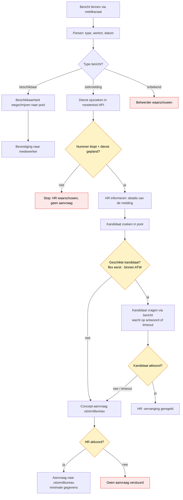

## Licentie

Dit is portfoliomateriaal — alle rechten voorbehouden. Zie license.md
Bekijken en beoordelen mag; gebruik of hergebruik alleen na toestemming.# Geautomatiseerde ziekmelding- en vervangingsflow

Een proof-of-concept die laat zien hoe je een bedrijfsproces — een ziekmelding die tot een vervanging leidt — kunt automatiseren met **privacy en menselijke controle als uitgangspunt**, niet als sluitstuk.

Dit project is gebouwd als portfoliostuk. Het draait op [n8n](https://n8n.io) en bevraagt een zelfgebouwde mock-API die een roostertool nabootst. De nadruk ligt niet op "zoveel mogelijk automatiseren", maar op *verantwoord* automatiseren: dataminimalisatie, controlepunten voordat er iets onomkeerbaars of kostbaars gebeurt, en een mens die beslist waar dat hoort.

## Wat het doet

Een medewerker meldt zich ziek via een meldkanaal, met alleen een werknemersnummer en een datum — geen naam, geen reden. De flow zoekt de geplande dienst op, waarschuwt HR, en probeert de dienst in te vullen: eerst met een beschikbare collega uit een pool (flexkrachten eerst, binnen de grenzen van de Arbeidstijdenwet), en pas als dat niet lukt met een aanvraag bij een uitzendbureau — die alleen de strikt noodzakelijke gegevens krijgt en pas na akkoord van HR de deur uit gaat.

Via hetzelfde kanaal kunnen medewerkers zich ook beschikbaar melden voor extra uren; dat vult de pool waaruit vervangers worden gekozen.

## De flow in beeld

De **gele ruiten** zijn beslispunten waar een controle of een mens beslist. De **rode blokken** zijn momenten waarop de flow bewust stopt en een mens waarschuwt in plaats van blind door te gaan.

## Ontwerpprincipes

- **Dataminimalisatie.** Bij elke stap krijgt elke ontvanger alleen wat bij zijn rol past. HR ziet de details; het uitzendbureau krijgt strikt minder (datum, dienst, uren — geen namen). De reden van het verzuim komt nergens in de flow.
- **Checks & balances.** Klopt data niet, ontbreekt ze, of is ze dubbelzinnig, dan zet de flow niets door maar haalt een mens erbij.
- **Human-in-the-loop bij kosten.** De uitzendaanvraag wordt klaargezet en gaat pas na expliciet akkoord van HR de deur uit.
- **Kanaal los van logica.** De verwerkingslogica staat los van het meldkanaal. De simulatie draait op e-mail; het productiekanaal (bijv. WhatsApp) is één vervangbaar laagje aan de rand.
- **Bron los van logica.** De roostergegevens komen via een API-aanroep binnen, precies zoals een echte roostertool later bevraagd zou worden. De databron is één vervangbaar punt.

## Hoe het technisch werkt

De flow bestaat uit drie ingangen (ziekmelding, beschikbaarheid, onbekend) en bevraagt een mock-API (`rooster-api/rooster.php`) die een roostertool simuleert. Die API kan:

- een dienst opzoeken op werknemersnummer + datum;
- de pool van beschikbare medewerkers teruggeven;
- een beschikbaarheid wegschrijven (met tijdstip van melden).

De API is beveiligd met een token en geeft JSON terug — hetzelfde patroon waarmee je later een echte roostertool zou aanroepen.

## Wat dit **wel** en **niet** is

Dit is een proof-of-concept met fictieve testdata, geen productiesysteem. Bewust benoemd, omdat eerlijk zijn over de grenzen van een oplossing er onderdeel van is:

- De roostertool is een **mock-API met verzonnen medewerkers en een rooster voor één maand**. In productie zit die data in een database en bevraag je de echte roostertool.
- De **ATW-check is een praktische benadering**. Hij toetst de kernregel — minimaal 11 uur rust tussen diensten en een weekgrens — maar niet de volledige wettelijke nuance (uitzonderingen, nachtdiensten, wekelijkse rust). De volledige toetsing hoort bij HR of een jurist.
- De **token staat in de URL** (voor de eenvoud). In een echte koppeling hoort een sleutel in een header, niet in een URL die in serverlogs belandt.
- Het **schrijf-endpoint** (beschikbaarheid opslaan) heeft alleen de token als bescherming. In productie hoort daar sterkere authenticatie op.

Dit project levert **geen juridisch advies** en garandeert niet dat een automation "de wet niet overtreedt". Wat het wél doet: risico's systematisch signaleren en expliciet aangeven waar een mens moet beslissen.

## Repostructuur

├── README.md
├── LICENSE
├── docs/
│ ├── casus.md # de uitgewerkte casus
│ ├── avg-afwegingen.md # privacykeuzes per stap
│ └── beslissingenlog.md # belangrijke keuzes en waarom
├── rooster-api/
│ └── rooster.php # mock roostertool-API
├── workflows/
│ └── ziekmelding-flow.json # n8n-export
└── examples/
└── personeel_rooster.xlsx # testdata (leesbare vorm)

## Techniek

- **n8n** — orkestratie van de flow
- **PHP** — de mock roostertool-API
- **E-mail (IMAP/SMTP)** — meldkanaal in de simulatie

---

Gebouwd door Monique Pielage · https://github.com/moniquepielage
